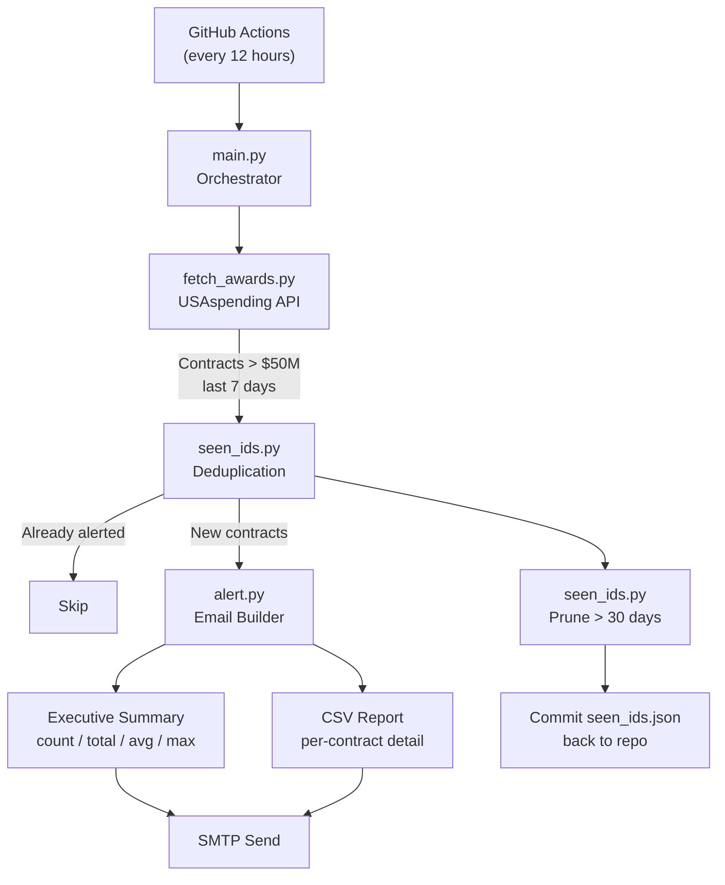

# Gov Contract Monitor


Gov Contract Monitor is a serverless automation tool that watches [USAspending.gov](https://www.usaspending.gov) and sends an **email alert with a CSV report** whenever the US Government awards a contract exceeding **$50 million**.

Runs automatically every 12 hours via GitHub Actions — no server, no database, no cost.

---

## Features

- **Scheduled Monitoring:** Polls the USAspending API every 12 hours for contracts awarded in the last 7 days above the $50M threshold.
- **Duplicate Prevention:** Tracks already-alerted contract IDs in a committed `seen_ids.json` file, so you only hear about each award once.
- **Executive Summary Email:** Each alert includes total contract count, total/largest/average award values, and unique recipient companies.
- **Attached CSV Report:** A detailed per-contract breakdown is dynamically generated and attached to every email.
- **Self-Pruning State:** `seen_ids.json` automatically drops entries older than 30 days to prevent unbounded growth.

---

## How It Works



---

## Components

The project has three core modules, each with a distinct responsibility:

- **`fetch_awards.py`:** Calls `POST /api/v2/search/spending_by_transaction/` on USAspending with contract type codes `A, B, C, D` and a `$50M` lower bound. No API key required.
- **`seen_ids.py`:** Maintains a lightweight JSON ledger of alerted contract IDs. Handles both deduplication on read and automatic pruning (30-day TTL) on write. Commits the updated state back to the repo so it persists across runs.
- **`alert.py`:** Builds the email body (Executive Summary) and attaches a freshly generated CSV with per-award rows. Sends via SMTP with TLS.

---

## File Structure

```
gov-contract-monitor/
├── main.py              # Orchestrator — runs fetch → dedup → alert → prune
├── fetch_awards.py      # USAspending API client
├── seen_ids.py          # Deduplication & state-pruning logic
├── alert.py             # Email builder & SMTP sender
├── seen_ids.json        # Persisted alert history (auto-updated by Actions)
├── requirements.txt
├── .env.example         # Template for local environment variables
└── .github/
    └── workflows/
        └── alert.yml    # GitHub Actions cron job (every 12 hours)
```

---

## Local Setup

### 1. Repository Setup & Dependencies

Clone the repository and install the Python dependencies from the root directory. A virtual environment is strongly recommended.

```bash
# Clone the repository
git clone https://github.com/Sohanuu66/gov-contract-monitor.git
cd gov-contract-monitor

# Set up a virtual environment (optional but recommended)
python -m venv .venv
source .venv/bin/activate        # On Windows: .venv\Scripts\activate

# Install dependencies
pip install -r requirements.txt
```

### 2. Configure Environment Variables

Copy the example env file and fill in your credentials:

```bash
cp .env.example .env
```

Edit `.env` with your values:

```env
SMTP_HOST=smtp.gmail.com
SMTP_PORT=587
SMTP_USER=you@gmail.com
SMTP_PASSWORD=abcd efgh ijkl mnop   # Gmail App Password — NOT your account password
ALERT_TO=you@gmail.com              # Comma-separated for multiple recipients
```

> [!NOTE]
> **Gmail App Password setup:**
> 1. Enable 2-Factor Authentication on your Google account.
> 2. Go to [myaccount.google.com/apppasswords](https://myaccount.google.com/apppasswords).
> 3. Create an app password and copy the 16-character string.
> 4. Use that as `SMTP_PASSWORD` — not your regular Google account password.

### 3. Run Locally

```bash
python main.py
```

The script will fetch recent awards, skip already-seen contracts, send an email alert for new ones, and update `seen_ids.json`.

---

## GitHub Actions Deployment

### 1. Fork this repository

### 2. Add GitHub Secrets

Go to **Settings → Secrets and variables → Actions → New repository secret** and mirror your `.env` values:

| Secret | Example | Description |
|---|---|---|
| `SMTP_HOST` | `smtp.gmail.com` | Your SMTP server |
| `SMTP_PORT` | `587` | SMTP port (587 for TLS) |
| `SMTP_USER` | `you@gmail.com` | Sender email address |
| `SMTP_PASSWORD` | `abcd efgh ijkl mnop` | Gmail App Password |
| `ALERT_TO` | `you@gmail.com` | Recipient(s), comma-separated |

### 3. Enable GitHub Actions

Make sure Actions are enabled in your repo: **Settings → Actions → Allow all actions**.

### 4. Test Manually

Go to **Actions → Contract Alert → Run workflow** to trigger a run immediately without waiting for the cron schedule.

---

## API Reference

- **Endpoint:** `POST https://api.usaspending.gov/api/v2/search/spending_by_transaction/`
- **Authentication:** None — the USAspending API is fully public.
- **Filter applied:** Award type codes `A, B, C, D` (contracts) with `award_amounts.lower_bound = 50,000,000` over a rolling 7-day window.